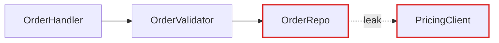
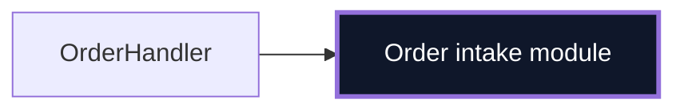

# Report Format — Architecture Review (Markdown)

The architectural review is delivered as a single markdown document: a chat message first, and — if the user wants it persisted — a copy at `docs/architecture-reviews/<YYYY-MM-DD>.md` in the target project. Diagrams are Mermaid code blocks (the devchain UI and most markdown viewers render them) plus ASCII where a mass diagram communicates better. The diagrams carry the weight; prose is sparse, plain, and uses the vocabulary terms without ceremony.

## Document skeleton

```markdown
# Architecture review — <repo name>

<date> · <N> candidates · Legend: solid box = module · dashed line = seam · red edge = leakage · thick box = deep module

## Candidates

### 1. <Title — short, names the deepening>
...one card per candidate (see below)...

## Top recommendation

**<Candidate title>** — one sentence on why this one first. (link to its card)
```

No introduction paragraph — straight into the candidates.

## Candidate card

Each candidate is one `###` section containing, in order:

- **Badge row** — recommendation strength and dependency category as bold inline tags, e.g. `**[Strong]** **[ports & adapters]**`. Strength is one of `Strong`, `Worth exploring`, `Speculative`. Category is one of `in-process`, `local-substitutable`, `ports & adapters`, `mock` (see VOCABULARY.md).
- **Files** — fenced code block listing the files/modules involved, one per line.
- **Problem** — one sentence. What hurts.
- **Solution** — one sentence. What changes.
- **Wins** — bullets, ≤6 words each, named in vocabulary terms: *"locality: bugs concentrate in one module"*, *"leverage: one interface, N call sites"*, *"interface shrinks; implementation absorbs the wrappers"*, *"delete 4 shallow wrappers"*. Never *"easier to maintain"* or *"cleaner code"* — those terms aren't in the glossary and don't earn their place.
- **Before / After** — two diagrams, labelled `**Before**` and `**After**` (see patterns below).
- **Standing-decision callout** (only if applicable) — one line as a blockquote: `> ⚠️ Contradicts <decision, cited where it's recorded> — but worth reopening because …`. Only surface a conflict when the friction is real enough to warrant revisiting. A past decision is context, not a veto: the callout informs the user's choice, it doesn't disqualify the candidate.

If a diagram needs a paragraph to be understood, redraw the diagram.

## Diagram patterns

Pick the pattern that fits the candidate. Mix them — variety is part of the point.

### Mermaid flowchart (the workhorse for dependencies / call flow)

Use when the point is "X calls Y calls Z, and look at the mess." Colour leakage edges/nodes red and the deep module dark via `classDef`. Sequence diagrams work well for "before: 6 round-trips; after: 1."

````markdown
**Before**



**After**


````

### Mass diagram (ASCII — for "interface as wide as implementation")

Two stacked rectangles per module: interface surface vs implementation. Shallow = nearly equal heights; deep = short interface over tall implementation. Use the deep/shallow ASCII shapes from VOCABULARY.md as the template.

### Cross-section (for layered shallowness)

A vertical list of layers a call passes through. Before: 6 thin layers each doing nothing (one line each). After: 1 thick band labelled with the consolidated responsibility.

### Call-graph collapse

Before: a Mermaid tree of function calls. After: one node, with the now-internal calls named in a short sub-list under the diagram, greyed out of the graph.

## Tone

Plain English, concise — but the architectural nouns and verbs come straight from VOCABULARY.md, and domain nouns come from the project's own glossary if it has one (say "the Order intake module," not "the FooBarHandler").

**Use exactly:** module, interface, implementation, depth, deep, shallow, seam, adapter, leverage, locality.

**Never substitute:** component, service, unit (for module) · API, signature (for interface) · boundary (for seam) · layer, wrapper (for module, when you mean module).

**Phrasings that fit:**

- "Order intake module is shallow — interface nearly matches the implementation."
- "Pricing leaks across the seam."
- "Deepen: one interface, one place to test."
- "Two adapters justify the seam: HTTP in prod, in-memory in tests."

No hedging, no throat-clearing, no "it's worth noting that…". If a sentence could be a bullet, make it a bullet. If a bullet could be cut, cut it. If a term isn't in the glossary, reach for one that is before inventing a new one.

---

*Adapted from the MIT-licensed `improve-codebase-architecture` HTML-REPORT.md by Matt Pocock — [github.com/mattpocock/skills](https://github.com/mattpocock/skills) — reworked from a Tailwind/Mermaid HTML artifact into portable markdown for devchain chat and docs.*
